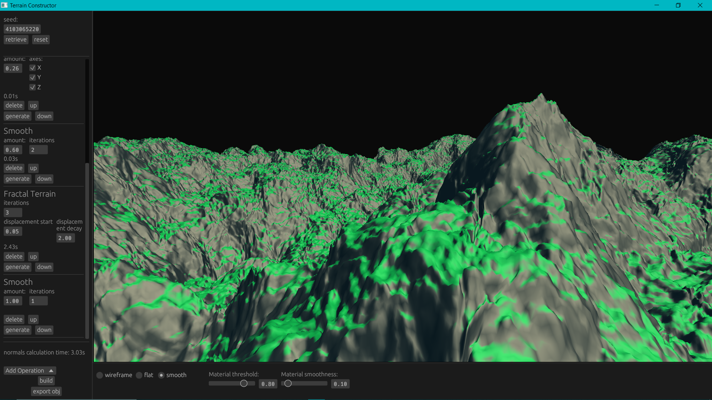
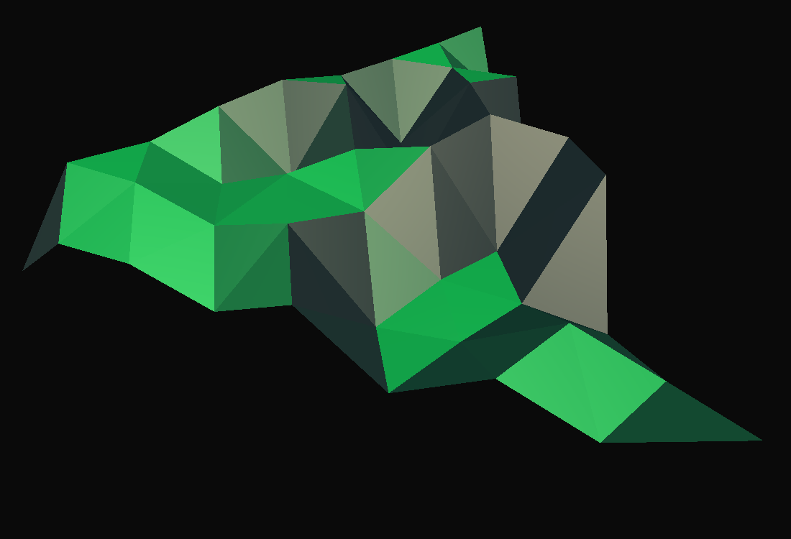
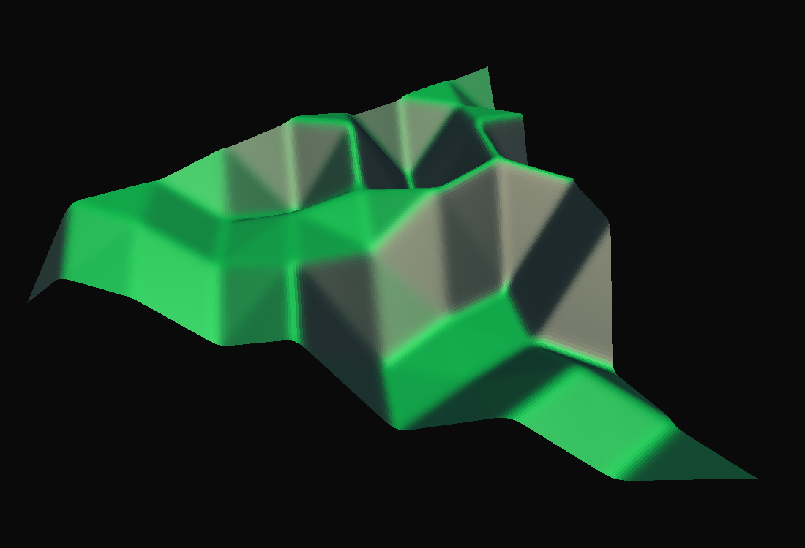

# Fractal Terrain Generator
## A procedural generation tool written in Rust.

 

 

---

The workflow consists of defining operations that are executed in sequence. An example of a mesh operations sequence:
1. Add Triangle
2. Subdivide
3. Displace Random
4. Subdivide
5. Smooth

After defining the sequence, a lot of meshes can be generated using different seeds. Afterwards, the mesh can be exported to `.obj`.

 

---

---

## Microdocumentation
Available [here](docs.md).

## Features
* Readable mesh thanks to fast Phong rendering.
* Different rendering modes - wireframe, flat, smooth
* Editable ground material
* Operation-based procedural mesh generation system
* Info about the time taken per operation
* Orbit camera
* Easily editable parameters thanks to `egui`'s widgets
* Editable seeds
* Exporting to `.obj`

 

## Technology
Written in **Rust** using **eframe** as the framework, **egui** as the UI library and **wgpu** as the rendering library. Shading is written in **wgsl**.